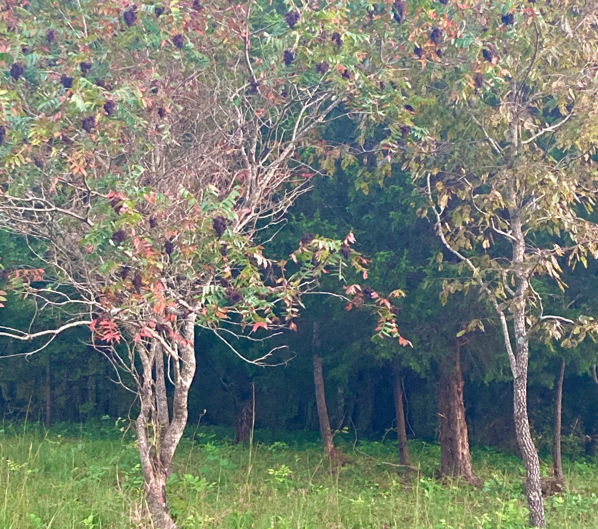

Some pieces composed (in real time) using the _cicada~_ object:
&nbsp;  
&nbsp;  
&nbsp;    

#### _and it has inside gardens with roses, and get in, and wander_  
#### _κι έχει μέσα γκιούλ μπαξέδους κι έμπα κι σιργιάνισι_



Voice: [Natalia Kotsani](https://nataliakotsani.com/)

In this piece, three cicadas were used to perform granular synthesis. Each "chirp" was a short sound grain taken from a recording of Natalia singing the folk song from Smyrna _Λιβισιανή μου πέρδικα_ (Livisiani mou perdika).  
The form of the piece comes from passage between types of order and disorder, as it moves slowly through parameter space, beginning with the cicadas chirping regularly in synchrony, then slowly losing synchrony (as the coupling_strength coefficient is brought to zero), then randomizing their chirp lengths, then returning to synchrony with these randomized chirp lengths.

